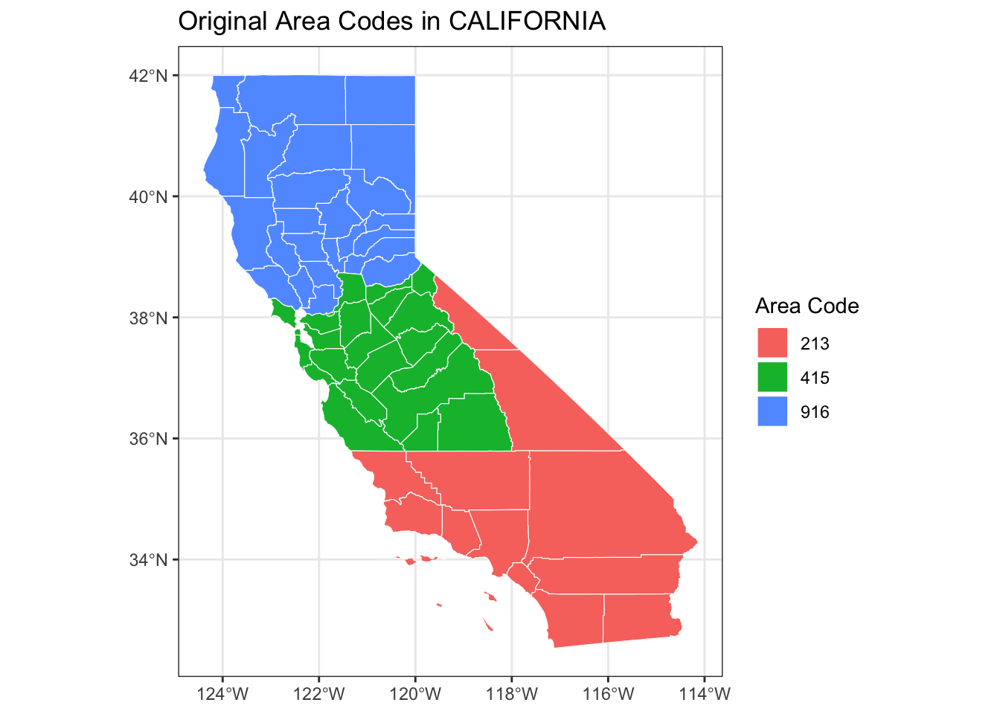
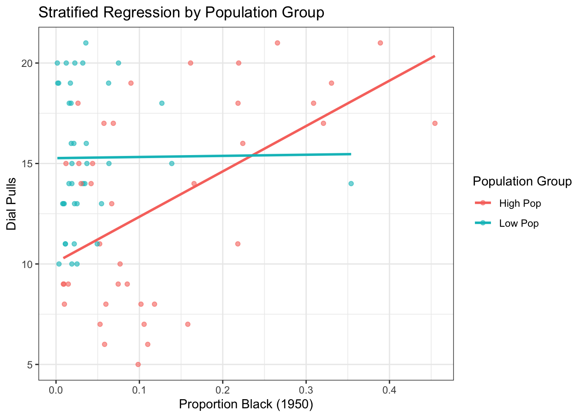
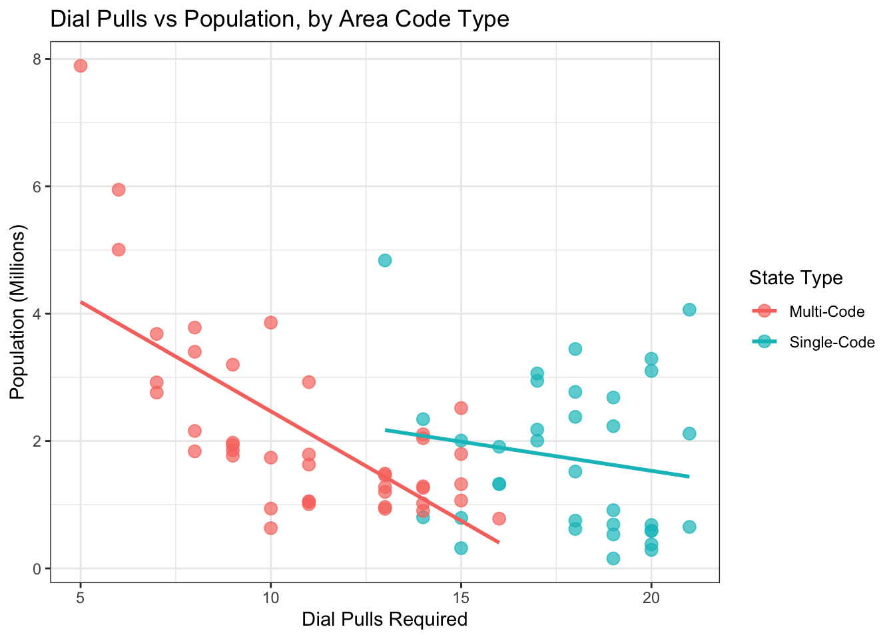

# Area Code Analysis: Demographic and Geographic Patterns in US Telecommunications Infrastructure

This project investigates the historical allocation of area codes under the 1947 North American Numbering Plan (NANP) to uncover whether the design of telecommunications infrastructure reflected systemic social and demographic biases. Using spatial joins, historical census data from the 1950s, and statistical modeling, the analysis maps original area code assignments to U.S. counties and analyzes patterns based on population size, race, and geographic distribution.



## Key Findings

- **Population-Based Assignments**: More populated areas received easier-to-dial codes, especially in states with multiple area codes to choose from.

- **Racial Disparities**: In high-density areas, codes serving predominantly Black populations were disproportionately harder to dial, suggesting potential bias in infrastructure design.

  

- **Predictive Factors**: Birth rates in the 1950s were strongly predictive of future area code splits, demonstrating how demographic indicators shaped long-term telecommunications demand.

- **Population and Dial Effort Correlation**: A strong negative correlation (r = -0.688) was found between population and dialing effort in multi-code states, while single-code states showed a much weaker relationship (r = -0.164).

  

## Project Components

The analysis is structured in five components:

1. **Assigning Area Codes to Counties**: Using spatial joins to map cities to counties and determine original area code assignments.

2. **Summarizing Regional Characteristics**: Aggregating demographic and telephone usage data at the area code level.

3. **Dialing Effort and Population Analysis**: Quantifying the relationship between population density and the physical effort required to dial area codes on rotary phones.

4. **Racial Disparities in Dialing Effort**: Investigating whether regions with higher Black populations received harder-to-dial codes.

5. **Predicting Area Code Growth**: Building models to predict future area code splits based on 1950s demographic and infrastructural features.

## Implementation

This project has been implemented in two programming environments:

- **R/Quarto**: The original implementation using R statistical packages, tidyverse, and spatial analysis libraries. See `Project.qmd`.

- **Python/Jupyter**: A parallel implementation reproducing the same analysis using Python data science libraries (pandas, geopandas, scikit-learn, etc.). See `Area_Code_Analysis.ipynb`.

Both implementations produce equivalent results, confirming the robustness of the findings.

## Project Structure

- `Project.qmd`: R-based Quarto document containing the analysis code and documentation
- `Project.html`: HTML output of the R-based analysis
- `Area_Code_Analysis.ipynb`: Python implementation of the analysis
- `Area_Code_Analysis_executed.ipynb`: Python implementation with execution results
- `final_project_data/`: Directory containing datasets used in the analysis
  - `cities_area_codes.csv`: Dataset linking cities to their area codes
  - `county_census_info.csv`: Census information for counties
  - `merged_counties_since_1950.csv`: Information on counties that have merged since 1950
  - `new_counties_since_1950.csv`: Information on new counties formed since 1950
  - `splits_overlays.xlsx`: Data on area code splits and overlays
  - `co99_d00_shp/`: Shapefile data for county boundaries
- `images/`: Visualizations for the README
- `Project_files/figure-html/`: Visualizations generated from the R analysis

## How to Use

### R/Quarto Version

1. Open the `Project.html` file to view the complete analysis with visualizations.
2. The `Project.qmd` file can be opened and modified in RStudio or any Quarto-compatible editor to reproduce or extend the analysis.

### Python Version

1. Ensure you have all the required dependencies installed:
   ```
   pip install pandas numpy matplotlib seaborn geopandas scikit-learn statsmodels xgboost
   ```

2. Open `Area_Code_Analysis.ipynb` in Jupyter Notebook or JupyterLab to run the analysis.

3. For proper execution with geopandas, you may need to install it with:
   ```
   python -m pip install geopandas
   ```

## Technologies Used

- **R Version**: R for statistical analysis, ggplot2 for visualization, sf for spatial operations, tidymodels for predictive modeling, and Quarto for document preparation.

- **Python Version**: pandas for data manipulation, geopandas for spatial operations, matplotlib/seaborn for visualization, scikit-learn and statsmodels for statistical modeling.

## Conclusion

This project demonstrates how design decisions—even numeric ones like area code assignments—can have long-lasting social consequences and reflect underlying societal biases. The findings provide a data-driven lens on infrastructure fairness and reveal patterns in how telecommunications resources were allocated in mid-century America.
